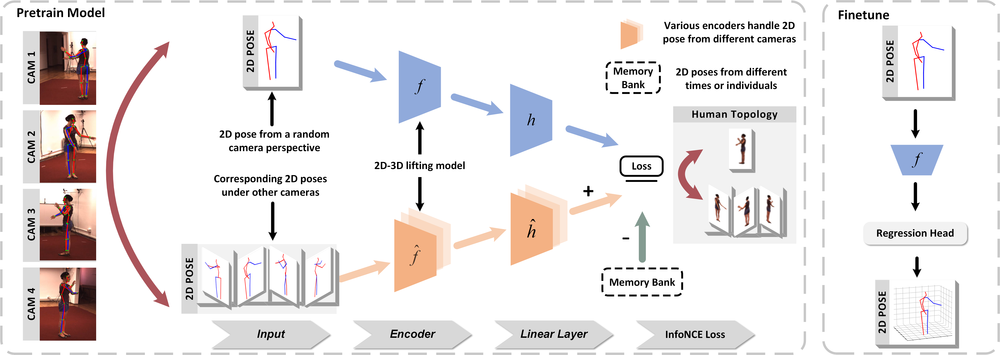

# Efficient 3D Human Pose Estimation for Edge AI

> [**Efficient 3D Human Pose Estimation for Edge AI**](https://arxiv.org/pdf/2302.),            
> Jialun Cai, Mengyuan Liu, Hong Liu, Wenhao Li, Shuheng Zhou
> *Submitted in IEEE Transactions on Image Processing (TIP), 2024*

## Acknowledgement

Our code is extended from the following repositories. We thank the authors for releasing the codes. 
- [MHFormer](https://github.com/Vegetebird/MHFormer)
- [MGCN](https://github.com/ZhimingZo/Modulated-GCN)
- [VideoPose3D](https://github.com/facebookresearch/VideoPose3D)
- [3d-pose-baseline](https://github.com/una-dinosauria/3d-pose-baseline)
- [3d_pose_baseline_pytorch](https://github.com/weigq/3d_pose_baseline_pytorch)
- [StridedTransformer-Pose3D](https://github.com/Vegetebird/StridedTransformer-Pose3D)
## Licence

This project is licensed under the terms of the MIT license.
